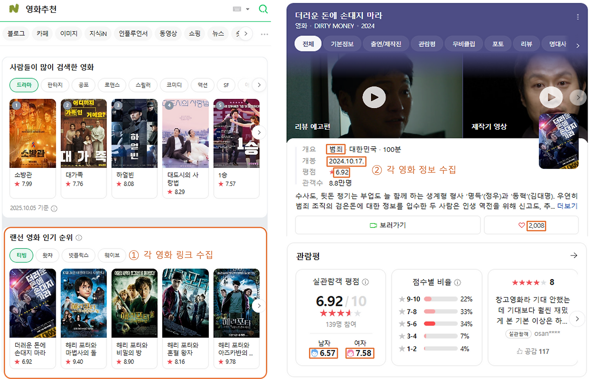
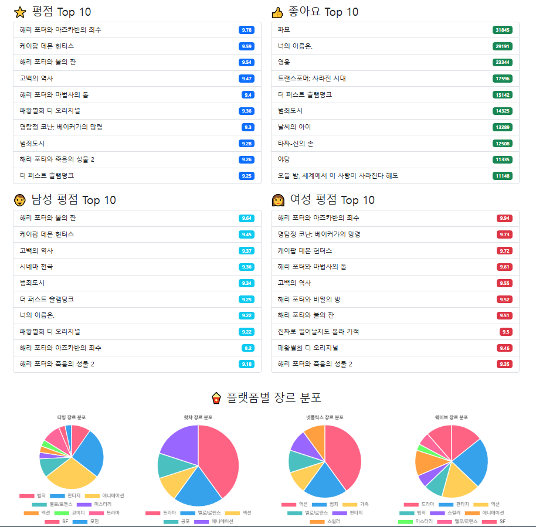

# MiniProjcet: movie-dashboard

## 프로젝트 개요
- 목적  
  : 네이버 영화 정보를 수집·정제하여  
    **사용자 관점(연령·성별·관심도)에 따라 영화 인기도를 비교할 수 있는 대시보드**를 구축
- 기간  
  : 2025년 10월 2일 (1일)
- 형태  
  : 2인 팀 미니 프로젝트 (데이터 수집 → 시각화)

 

## 팀원 및 역할
- 김민정  
  - ‘랜선 영화 인기 순위’ 기준 데이터 수집 로직 설계  
  - 영화 제목·장르·평점 크롤링 및 데이터 정제  
  - 랜선 영화 인기 순위 대시보드 구성 및 시각화

- 최범조  
  - ‘사람들이 많이 검색한 영화’ 기준 데이터 수집 및 대시보드 제작  
  - 사용자 입력으로 크롤링을 실행하는 버튼 기능 구현  
  - 팀 작업 통합 및 공통 기능 관리

 

## 수집 정보 예시

 

## 대시보드 예시

